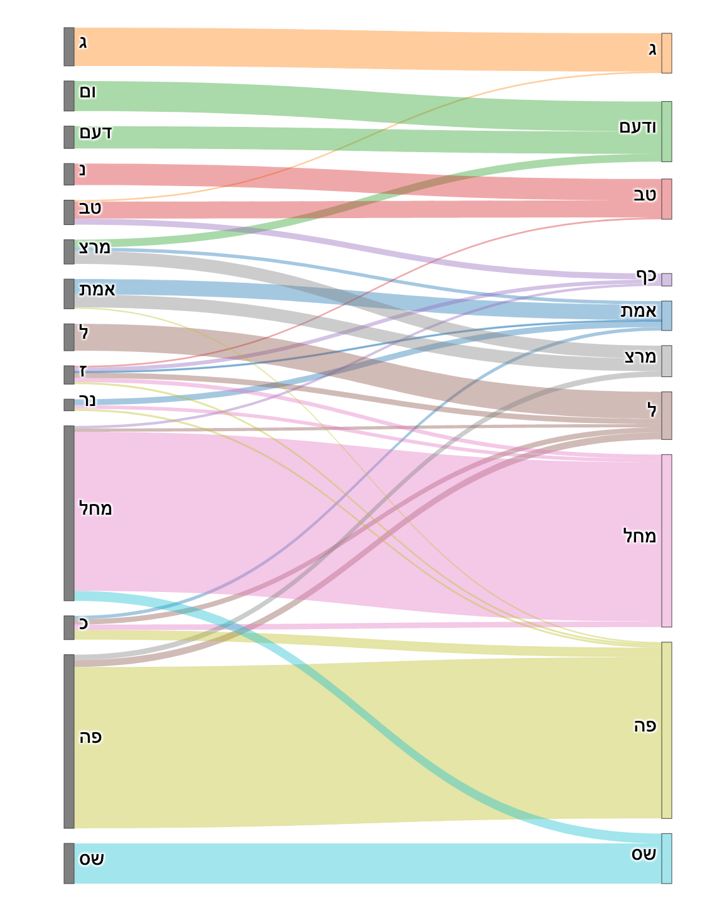

# elections-vote-transfer
## Analysis of vote transfer between two elections
### Harel Cain, September 2019

The code analyzes the ballot results for ~10,000 polling stations with
the same identity (locale and polling station number) between the elections for the 21st and the 22nd knesset.

It assumes there is a linear transfer matrix $M$ such that $V_21 * M ~ V_22$.

It solves for the matrix M (argmin_M |V_21*M-V_22|) in one of three ways:

1. Closed-form least linear squares. This way M is not constrained and may contain negative numbers as well as numbers > 1, also its columns don't sum up to 1.
2. Non-negative least squares. This handles the non-negative constraint but still doesn't guarantee stochasity.
3. Convex optimization with the SCS solver, with constraints on 0<M<1 and M.sum(axis=1) = 1.

There is an option of treating the non-participating voters as an additional party.

The motivation and idea came from Itamar Mushkin. See https://www.themarker.com/techblogs/ormigoldstein/BLOG-1.6567019.

The elections results are taken from https://votes21.bechirot.gov.il/ and https://votes22.bechirot.gov.il/ ( 20/09/2019 02:37 version).

